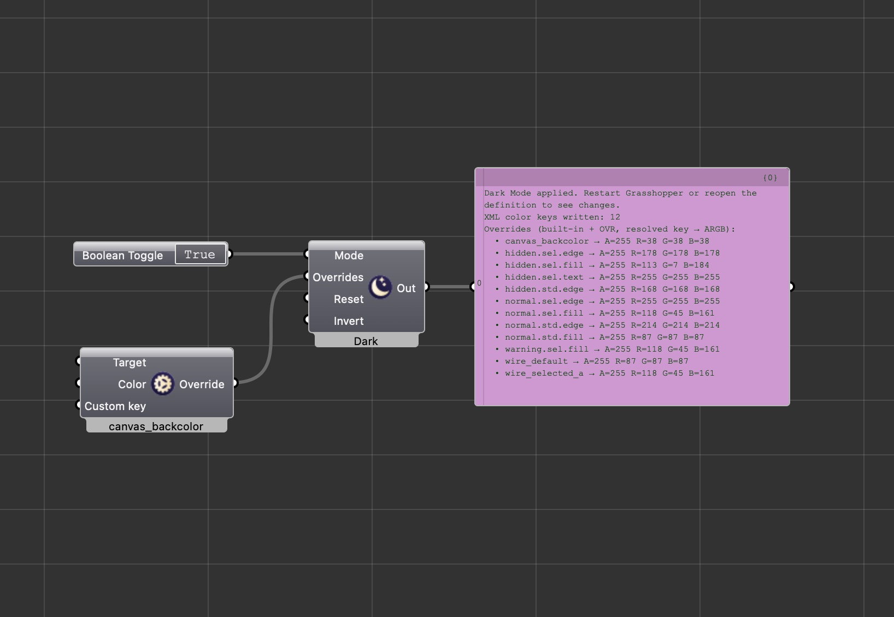

# GH Dark Mode

## What it does

**GH Dark Mode** is a Grasshopper 1 plugin for **Rhino 8** that switches the Grasshopper **canvas and UI** between a **dark theme** and your **saved “light” baseline**. It uses Grasshopper’s **`GH_Skin`** API and the same `grasshopper_gui.xml` skin file the app already uses, so changes persist across sessions.

On the first run, the plugin stores a snapshot of your current skin as **`ghdarkmode_baseline_gui.xml`**. **Mode = false** restores that snapshot (your pre–dark-mode look). **Mode = true** applies a tuned dark theme and writes a set of default XML color overrides (wires, component fills/edges, etc.).

**GH Dark Mode Override** is a second component that picks individual **skin color keys** (from an embedded manifest) and outputs **tokens** you connect to the main component’s **OVR** input—so you can fine-tune colors without editing XML by hand.

---

## How to use

1. **Install** **`GHDarkMode.gha`**: download the latest **`GHDarkMode.gha`** from [**GitHub Releases**](https://github.com/puya/GHDarkMode/releases) (or build from source below). Copy it into Grasshopper’s **Libraries** folder, or use the **Rhino Package Manager** if a Yak package is published. Restart Rhino/Grasshopper.
2. In Grasshopper, open **Params → Util** and place **GH Dark Mode**.
3. Wire **Mode (M)** with a boolean or button: **`true`** applies dark mode; **`false`** restores the baseline snapshot.
4. Optional: place **GH Dark Mode Override**, choose a **Target** key and **Color**, and connect its output into **Overrides (OVR)** on the main component (list input). Built-in dark defaults and your **OVR** tokens are merged; same key from **OVR** wins.
5. **Reset (R)** restores the baseline file if it exists, otherwise resets GUI XML toward factory defaults (restart Grasshopper to refresh everything).
6. **Invert (I)** is an optional debug action that inverts colors in `grasshopper_gui.xml`—use sparingly; use **Reset** or **Mode = false** to recover.

After a dark solve, **Out** shows status, how many XML color keys were written, and the full merged override list (use a **Panel** to read it).

You may need to **restart Grasshopper** or reopen the definition for the canvas to fully match the new skin.

**More detail:** [src/GHDarkMode/README.md](src/GHDarkMode/README.md)

---

## Screenshot



---

## Build from source (Mac)

**Prerequisites:** Rhino 8 for Mac, .NET 7 SDK (or later).

```bash
./scripts/build-and-install.sh
```

This builds **`dist/GHDarkMode.gha`** and copies it into your Grasshopper **Libraries** folder. Artifact only: `./scripts/build.sh`.

**SDK / Rhino path:** [docs/SDK_VERSION_AND_COMPATIBILITY.md](docs/SDK_VERSION_AND_COMPATIBILITY.md)

### GitHub Releases (maintainers)

Releases are built in **GitHub Actions** (`.github/workflows/release.yml`) when you push a **version tag** matching `v*`, e.g.:

```bash
git tag v1.0.1
git push origin v1.0.1
```

The workflow runs on **Ubuntu**, uses the **NuGet** Grasshopper reference (same as CI; see [SDK compatibility](docs/SDK_VERSION_AND_COMPATIBILITY.md)), uploads **`GHDarkMode.gha`** with **`gh release create`** and the default **`GITHUB_TOKEN`**—no personal access token required in repo settings.

You can also create the tag in the GitHub UI, then push it. Bump **`GHDarkModeInfo.Version`** and **`packaging/manifest.yml`** before tagging so the binary and Yak metadata stay aligned.

### Yak / Rhino Package Manager (maintainers)

1. Keep **`packaging/manifest.yml`** **`version`** in sync with **`GHDarkModeInfo.Version`**.
2. Set **`url`** in the manifest before publishing.
3. **`./scripts/yak-pack.sh`** then **`yak login`** and **`yak push`** on the generated **`.yak`** — see [Creating a Grasshopper plug-in package](https://developer.rhino3d.com/guides/yak/creating-a-grasshopper-plugin-package/) and [Pushing a package](https://developer.rhino3d.com/guides/yak/pushing-a-package-to-the-server/).

Locally, **`gh`** (GitHub CLI) is handy for releases too, but the **automated** upload uses **`gh` inside the workflow**, not your machine’s auth.

---

## Repository layout

| Path | Purpose |
|------|---------|
| **src/GHDarkMode/** | Plugin source |
| **icons/** | 24×24 PNG icons (embedded in `.gha`) |
| **scripts/** | `build.sh`, `build-and-install.sh`, `yak-pack.sh` |
| **packaging/manifest.yml** | Yak package metadata |
| **docs/** | Screenshot, SDK notes, **DEVELOPMENT.md** |
| **.github/workflows/** | **CI** (build on push/PR), **Release** (`.gha` on `v*` tags via `gh release create`) |
| **REPLICATION_SPEC.md** | Historical spec for the skin / `GH_Skin` approach |

---

## License

Provided for use with Rhino and Grasshopper.
